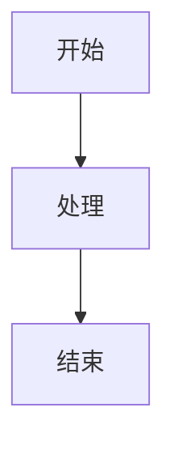

# 网站使用指南

## 如何上传文章

### 1. 创建新文章

```bash
pnpm run new-post -- "文章标题"
```

这会在 `src/content/posts/` 下生成一个 `.md` 文件。

### 2. 编辑文章头信息 (Front Matter)

文章文件顶部的 `---` 之间是元数据：

```yaml
---
title: 我的文章标题
published: 2026-07-01               # 发布日期
updated: 2026-07-01                 # 更新日期（可选）
description: '文章简要描述'           # SEO 描述，不写则自动截取正文
image: '/images/project-xxx.jpg'    # 封面图（可选），放在 public/images/ 下
tags: [STM32, 嵌入式, 教程]          # 标签
draft: false                        # true 则文章不公开
pinned: false                       # true 则置顶
---
```

### 3. 写正文（Markdown）

```markdown
## 二级标题

正文内容...

### 三级标题

**加粗**，*斜体*，`行内代码`


```c
// 代码块
int main() {
    return 0;
}
\```

> 引用文字

- 列表项
- 列表项
```

#### 特殊功能

**提示框（Admonition）：**

```markdown
:::note
这是一个普通提示
:::

:::tip
这是一个小技巧
:::

:::warning
这是一个警告
:::

:::caution
这是一个注意事项
:::
```

**数学公式（KaTeX）：**

```markdown
行内公式 $E = mc^2$

块级公式：
$$
\int_0^\infty e^{-x^2} dx = \frac{\sqrt{\pi}}{2}
$$
```

**Mermaid 图表：**

````markdown

````

### 4. 本地预览

```bash
pnpm run dev
```

浏览器打开 `http://localhost:4321` 查看效果。

### 5. 上传发布

```bash
# 提交并推送到 GitHub
git add .
git commit -m "feat: 添加文章《文章标题》"
git push
```

推送后 GitHub Actions 自动构建部署，1-2 分钟后刷新网站即可看到。

---

## 功能配置

### 背景图片

在 `src/config.ts` 的 `background.src` 数组中添加图片路径：

```ts
background: {
    enable: true,
    src: [
        "/images/bg.webp",
        "/images/bg/new-bg.webp",  // 新增背景
    ],
    opacity: 0.35,     // 透明度
    switchInterval: 0,  // 自动切换间隔（毫秒），0 为仅跳转时切换
},
```

背景图片放在 `public/images/bg/` 目录下。

### 启用 Giscus 评论

1. 访问 [giscus.app](https://giscus.app)，填入仓库 `koitoyuu111/koitoyuu111.github.io`
2. 获取 `repoId` 和 `categoryId`
3. 在 `src/config.ts` 中修改：

```ts
export const giscusConfig: GiscusConfig = {
    enable: true,           // 改为 true
    repoId: "R_xxx",        // 填入获取的 ID
    category: "Announcements",
    categoryId: "DIC_xxx",  // 填入获取的 ID
    // ...
};
```

### 修改网站运行起始日期

`src/config.ts` 中的 `siteStartDate`：

```ts
siteStartDate: "2026-06-01",
```

### 修改个人信息

`src/config.ts` 中的 `profileConfig`：

```ts
export const profileConfig: ProfileConfig = {
    avatar: "/images/avatar.webp",
    name: "你的名字",
    bio: ["第一行简介", "第二行简介"],
    links: [
        { name: "GitHub", icon: "fa6-brands:github", url: "https://github.com/xxx" },
        { name: "Bilibili", icon: "fa6-brands:bilibili", url: "https://space.bilibili.com/xxx" },
    ],
};
```

---

## 目录结构

```
my_web_now/
├── src/
│   ├── content/posts/      # 文章 .md 文件放这里
│   ├── config.ts           # 站点配置
│   ├── pages/              # 页面路由
│   └── components/         # UI 组件
├── public/
│   └── images/             # 静态图片（文章插图、背景等）
├── scripts/
│   └── new-post.js         # 新建文章脚本
└── package.json
```

---

## 常用命令

| 命令 | 说明 |
|------|------|
| `pnpm run dev` | 启动本地开发服务器 |
| `pnpm run build` | 构建生产版本 |
| `pnpm run new-post -- "标题"` | 创建新文章 |
| `pnpm run format` | 格式化代码 |
| `pnpm run type-check` | TypeScript 类型检查 |
